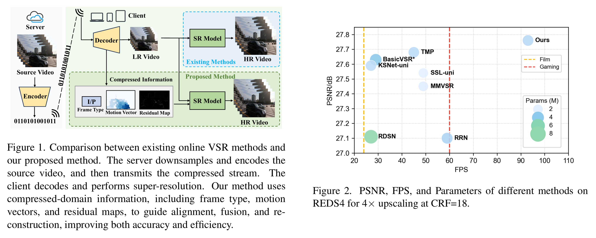
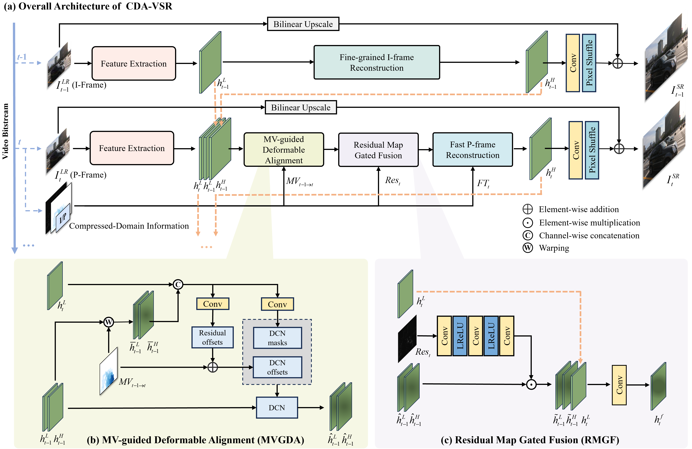
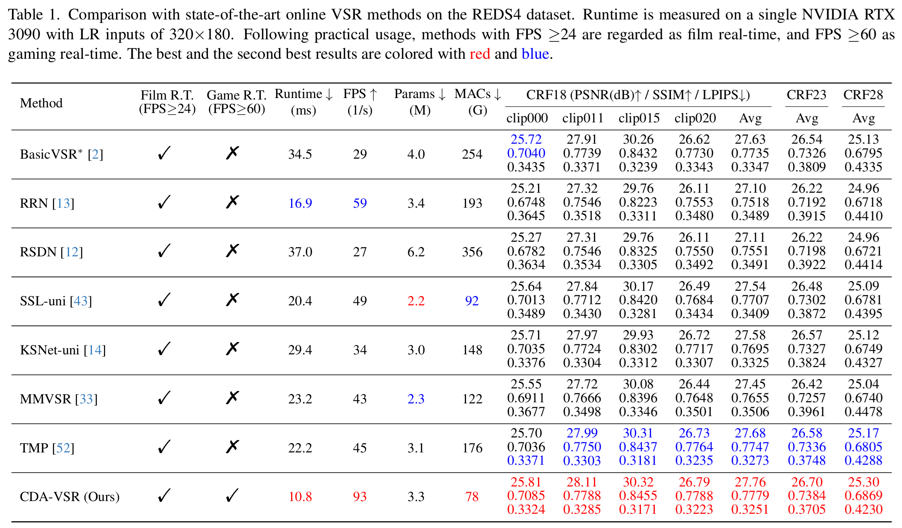
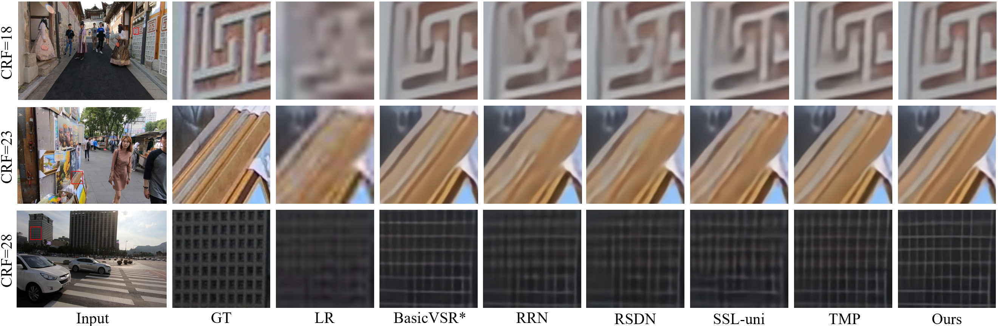

# [CVPR 2026] CDA-VSR: Compressed-Domain-Aware Online Video Super-Resolution

<p align="center">
  
</p>

<p align="center">
  <b>CDA-VSR</b> is a compressed-domain-aware framework for <b>online video super-resolution</b>.<br>
  It explicitly exploits motion vectors, residual maps, and frame types from the compressed bitstream to improve both reconstruction quality and inference efficiency.
</p>

<p align="center">
  <a href="#news">News</a> •
  <a href="#overview">Overview</a> •
  <a href="#results">Results</a> •
  <a href="#repository structure">Repository Structure</a> •
  <a href="#how to use">How to use</a> •
  <a href="#citation">Citation</a>
</p>

---

## News

- **[2026/03]** Repository initialized.
- **[2026/03]** README released.
- **[Coming Soon]** Pretrained models and cleaned data preparation scripts will be released.

---

## Overview

Online video super-resolution (VSR) aims to recover high-resolution (HR) frames from low-resolution (LR) inputs under strict latency constraints, where only the current and previous frames are available. Most existing online VSR methods operate only on decoded LR frames and often suffer from expensive motion estimation or limited temporal modeling efficiency.

<p align="center">
  
</p>

To address this issue, **CDA-VSR** explicitly introduces **compressed-domain priors** into online VSR, including:

- **Motion Vectors (MV)** for efficient coarse alignment
- **Residual Maps** for selective temporal fusion
- **Frame Types (I/P frames)** for adaptive reconstruction

Based on these priors, CDA-VSR contains three key modules:

- **MVGDA**: Motion-Vector-Guided Deformable Alignment
- **RMGF**: Residual Map Gated Fusion
- **FTAR**: Frame-Type-Aware Reconstruction

This design enables CDA-VSR to achieve a favorable trade-off between **restoration quality** and **runtime efficiency**.

## Results

### Quantitative Highlights

- On **REDS4**, CDA-VSR achieves approximately **90 FPS** while maintaining competitive or superior reconstruction quality.

<p align="center">
  
</p>

### Qualitative Comparison

<p align="center">
  
</p>

CDA-VSR reconstructs clearer edges and finer textures than representative online VSR baselines, especially in regions with large motion and compression artifacts.

## Repository Structure

```text
CDA-VSR/
├── basicsr/                      # Core framework
│   ├── archs/                    # Network architectures
│   ├── data/                     # Dataset definitions
│   ├── losses/                   # Loss functions
│   ├── metrics/                  # Evaluation metrics
│   ├── models/                   # Model wrappers
│   ├── train.py                  # Training entry
│   └── test.py                   # Testing entry
├── options/
│   ├── train/
│   │   └── train_CDA-VSR.yaml
│   └── test/
│       ├── test_CDA-VSR_REDS4.yaml
│       └── test_CDA-VSR_Inter4K.yaml
├── figures/                      # README figures
├── create_lmdb.py
├── requirement.txt
├── LICENSE.txt
└── README.md
```

## How to use
### Requirements

- Python 3.8+
- PyTorch 1.10+
- CUDA 11.x

### Training
Run training with:
```text
python basicsr/train.py -opt options/train/train_CDA-VSR.yaml
```
### Testing
#### Test on REDS4
Run training with:
```text
python basicsr/test.py -opt options/test/test_CDA-VSR_REDS4.yaml
```
#### Test on REDS4
Run evaluation with:
```text
python basicsr/test.py -opt options/test/test_CDA-VSR_Inter4K.yaml
```

## Citation
If you find this repository useful in your research, please cite:
```bibtex
@article{wang2026cdavsr,
  title={Compressed-Domain-Aware Online Video Super-Resolution},
  author={Wang, Yuhang and Li, Hai and Hou, Shujuan and Dong, Zhetao and Yang, Xiaoyao},
  journal={arXiv preprint arXiv:2603.07694},
  year={2026}
}
```
## Contact
Please leave a issue or contact zhengqiang with bitwangyuhang@163.com

## License and Acknowledgement

This project is built upon [BasicSR](https://github.com/XPixelGroup/BasicSR) and [TMP](https://github.com/xtudbxk/TMP). We sincerely thank the authors for making their code publicly available.